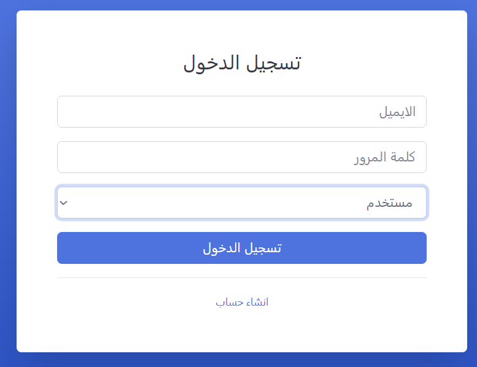
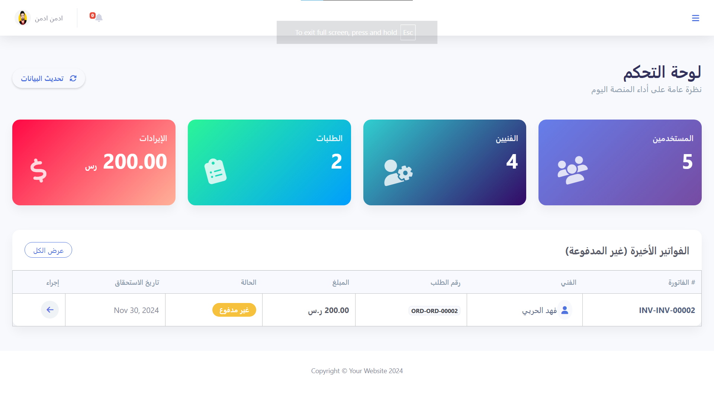

# FixPro - منصة إدارة الصيانة والدعم الفني

**FixPro** هو نظام متكامل لإدارة عمليات الصيانة والدعم الفني للأجهزة، يهدف إلى تسهيل التواصل بين العملاء (المستخدمين) وفنيي الصيانة تحت إشراف إداري.

## صفحة تسجيل الدخول

## 🚀 المميزات الرئيسية

### 1. لوحة تحكم المستخدم (User Dashboard)
- **طلب صيانة:** إنشاء طلبات إصلاح جديدة مع وصف المشكلة وإرفاق صور.
- **متابعة الطلبات:** تتبع حالة الطلبات (جديد، قيد العمل، مكتمل).
- **المقالات التقنية:** تصفح مقالات تعليمية وحلول للمشاكل الشائعة ينشرها الفنيون.
- **التقييمات:** تقييم أداء الفنيين وجودة الخدمة المقدمة.

### 2. لوحة تحكم الفني (Technician Dashboard)
- **إدارة الطلبات:** استقبال ومعالجة طلبات الصيانة وإدارتها.
- **المقالات:** كدليل معرفي، يمكن للفني نشر مقالات تقنية (مثل حلول شاشة الموت، مشاكل لوحة المفاتيح).
- **الفواتير:** إنشاء فواتير إلكترونية للطلبات المكتملة بصيغة PDF.

### 3. لوحة تحكم الأدمن (Admin Dashboard)

- **الإدارة الشاملة:** إدارة المستخدمين، الفنيين، والأجهزة المتاحة في النظام.
- **التقارير:** استعراض الإحصائيات والتقارير العامة للنظام.

## 🛠 التقنيات المستخدمة (Tech Stack)

- **اللغات:** PHP (Vanilla), HTML5, CSS3, JavaScript.
- **قواعد البيانات:** MySQL (MariaDB).
- **المكتبات:**
  - **PHPMailer:** لإرسال رسائل البريد الإلكتروني والتحقق من الحسابات.
  - **TCPDF:** لتوليد تقارير الفواتير والمستندات بصيغة PDF.
  
## 📁 هيكل المشروع

- `/admin`: ملفات لوحة تحكم المدير.
- `/technician`: ملفات لوحة تحكم الفنيين.
- `/user`: ملفات لوحة تحكم المستخدمين.
- `/layout`: القوالب التصميمية المشتركة (Navbar, Sidebar, Footer).
- `/assets`: الملفات المساعدة (Images, CSS, JS).
- `/PHPMailer` & `/TCPDF`: المكتبات الخارجية المستخدمة.
- `config.php`: إعدادات الاتصال بقاعدة البيانات والمتغيرات العامة.

## ⚙️ كيفية التشغيل

1. **تجهيز قاعدة البيانات:**
   - قم بإنشاء قاعدة بيانات جديدة باسم `fix_pro`.
   - قم باستيراد ملف `fix_pro.sql` الموجود في المجلد الرئيسي.

2. **إعداد الاتصال:**
   - تأكد من مطابقة بيانات قاعدة البيانات في ملف `config.php`.

3. **تشغيل الخادم:**
   - انقل مجلد المشروع إلى `htdocs` إذا كنت تستخدم XAMPP.
   - افتح المتصفح وتوجه إلى `http://localhost/FixPro/`.

## 📧 التواصل
للاستفسارات، يرجى التواصل عبر البريد الإلكتروني الموضح في ملف الإعدادات.
