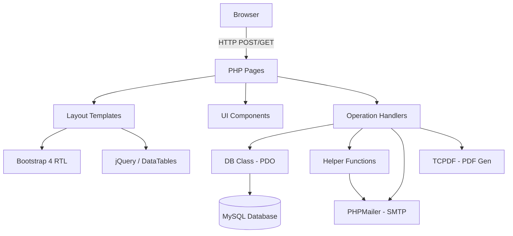
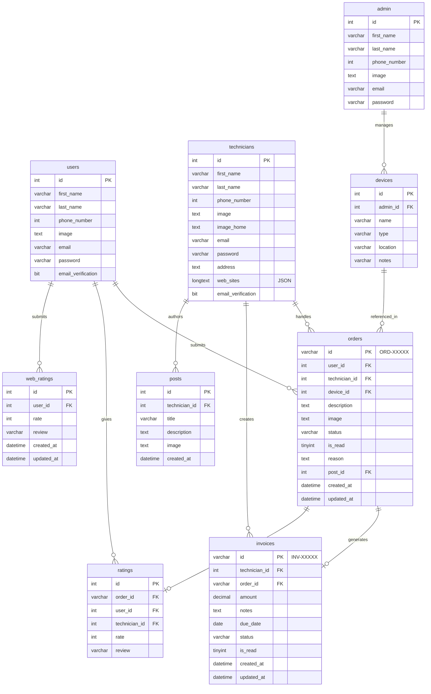
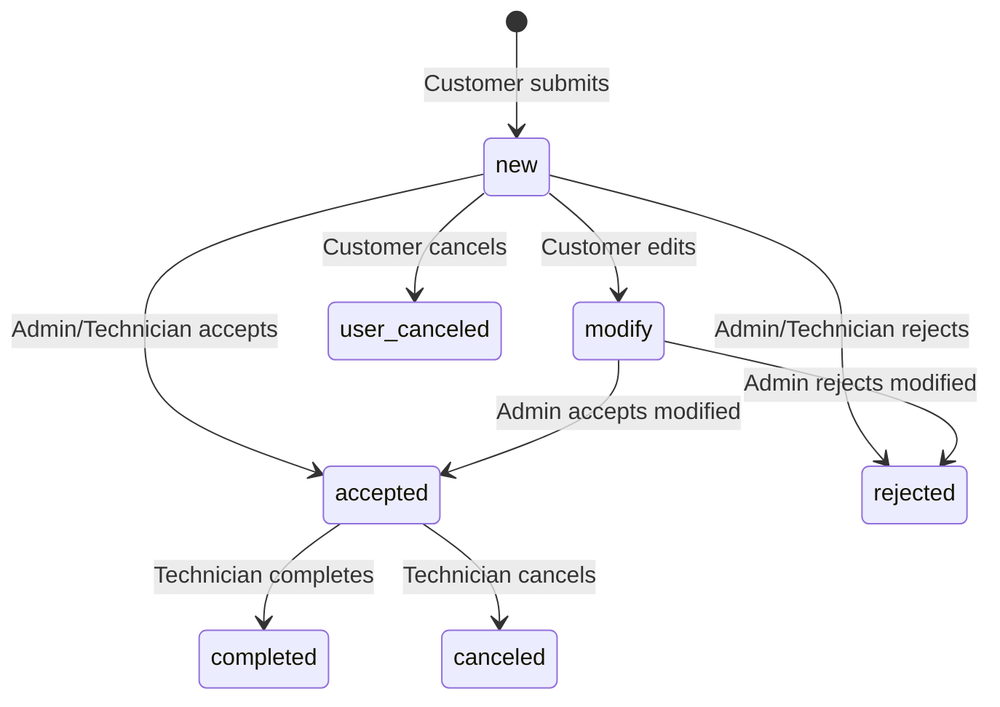
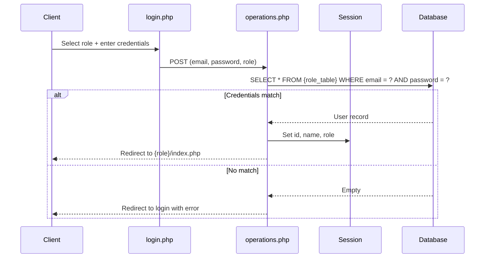
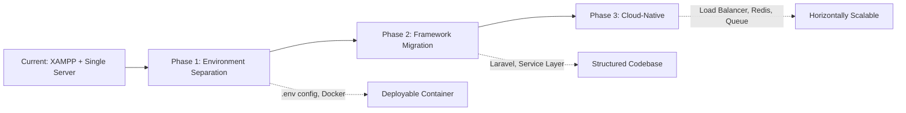

# FixPro


## Overview

FixPro is a web-based maintenance and technical support management platform that digitizes the complete lifecycle of electronic device repair services. It connects three distinct user roles—customers, technicians, and administrators—through dedicated portal interfaces that handle the full workflow from repair request submission to invoice settlement.

The platform addresses the real-world problem of managing device repair operations: customers need a transparent way to request maintenance and track progress; technicians need to manage their repair queue, publish technical knowledge articles, and generate invoices; administrators need oversight of the entire operation including device management, order supervision, and reporting.

Built as a traditional LAMP-stack application using vanilla PHP 8.x with a custom database abstraction layer, the project demonstrates practical software engineering through role-based access control, workflow state management, PDF document generation, email notification integration, and a multi-module architecture organized around domain actors.

---

## Key Features

### Customer Portal

- Submit maintenance requests with device selection, image uploads, and problem descriptions
- Track repair status through real-time notifications (new, accepted, rejected, modified, completed, canceled)
- Browse the technician-authored knowledge base for self-service troubleshooting
- Rate technicians with star ratings and text reviews after completed repairs
- Download PDF invoices for completed services
- Manage profile and change password
- Submit site-wide reviews (web ratings)

### Technician Portal

- Accept or reject incoming repair requests with reason annotations
- Manage repair workflow (accept → complete)
- Publish and manage technical knowledge base articles with rich content and images
- Generate PDF invoices for completed repairs
- Track assigned orders with real-time notifications for new/modified requests
- Manage profile, profile images, and home workspace images
- Store professional website links (JSON-based portfolio field)

### Administrator Portal

- Full device catalog management (add, edit, delete, view)
- Monitor all repair orders across the platform with accept/reject authority
- View and manage all invoices system-wide
- Access the knowledge base read-only for content oversight
- Generate PDF reports from aggregated order and invoice data
- Manage admin profile and credentials
- Real-time notifications for new invoices from technicians

### Cross-Cutting Features

- Email verification for new accounts via SMTP (PHPMailer)
- Token-based email verification with time-limited expiry
- Role-based sidebar navigation that adapts to the authenticated user's permissions
- Flash message alert system for operation feedback (success/error)
- Confirmation modals for destructive actions (delete/cancel)
- Responsive RTL (right-to-left) Arabic interface
- Data table pagination, search, and export capabilities
- File upload system with automatic duplicate-name handling

---

## Architecture

### Architecture Style

The application follows a **role-based modular monolith** pattern. Each user role (admin, technician, user) operates within its own module directory with a parallel file structure, while sharing common infrastructure (layout templates, database access, configuration, helpers).

This is not a framework-based MVC application. It uses a **page-based routing** pattern where each PHP file corresponds to a specific view or operation endpoint. Form submissions are handled by `operations.php` files that dispatch actions via `POST` parameter switching.

### Layered Structure

```
┌─────────────────────────────────────────────────┐
│              Presentation Layer                   │
│   Layout templates, views, components, assets    │
├─────────────────────────────────────────────────┤
│              Operation Handlers                   │
│   POST dispatch (operations.php per module)      │
├─────────────────────────────────────────────────┤
│              Data Access Layer                    │
│   Custom DB class (PDO query builder)            │
├─────────────────────────────────────────────────┤
│              Database Layer                       │
│   MariaDB / MySQL (InnoDB, utf8mb4)             │
└─────────────────────────────────────────────────┘
```

### Dependency Flow



### Module Isolation

Each role module follows an identical directory convention, which provides structural predictability even without a framework:

```
{role}/
├── index.php              # Dashboard / entry point
├── login.php              # Role-specific login
├── register.php           # Registration (technician/user only)
├── operations.php         # POST action dispatcher
├── email_verification.php # Email verification handler
├── orders/
│   ├── index.php          # List orders
│   ├── add.php            # Create order form
│   ├── details.php        # Order detail view
│   ├── edit.php           # Edit order form
│   └── operations.php     # Order CRUD operations
├── posts/                 # Knowledge base management
├── invoices/              # Invoice management
└── profile/               # Profile management
```

---

## Design Patterns

### Query Builder Pattern (DB Class)

The `DB` class (`DB.php`) implements a lightweight query builder over PDO. It uses a fluent interface with method chaining:

```php
$orders = (new DB('orders o'))
    ->join('users u', 'o.user_id=u.id')
    ->select("o.*,CONCAT(u.first_name, ' ',u.last_name) as full_name")
    ->where(['is_read' => 0, 'o.technician_id' => $_SESSION['id']])
    ->where("status in('new','modify')")
    ->get();
```

Key methods: `from()`, `join()`, `where()`, `select()`, `orderBy()`, `groupBy()`, `get()`, `getOne()`, `getBy()`, `getAll()`, `insert()`, `update()`, `delete()`, `getNextId()`.

### Template Method Pattern (Layout System)

The layout system (`layout/`) implements a template method pattern where every page follows the same structural skeleton:

```php
require '../../config.php';        // Configuration + DB
if (!isRole('admin')) redirect();  // Auth gate
require '../../layout/index.php';  // Open HTML + head + sidebar
// ... page-specific content ...
require ROOT_PATH . '/layout/navbar.php';
// ... main content ...
require ROOT_PATH . '/layout/footer.php';
require ROOT_PATH . '/layout/end.php';  // Close HTML + JS + modals
```

The `layout/index.php` → `start.php` → `sidebar.php` → `navbar.php` → `footer.php` → `end.php` chain provides consistent page structure while allowing role-conditional sidebar rendering.

### Component Pattern (Reusable UI)

The `components/` directory contains reusable UI fragments:

- **`alert.php`** — Session-based flash message system that reads `$_SESSION['error']` / `$_SESSION['success']` and renders Bootstrap dismissible alerts
- **`confirmation.php`** — Generic delete confirmation modal using jQuery event delegation on `.btnDelete` class, intercepting form submission

### Action Dispatcher Pattern (Operations)

Each `operations.php` file acts as a POST action dispatcher using conditional branching:

```php
if (isset($_POST['add'])) { /* handle add */ }
elseif (isset($_POST['edit'])) { /* handle edit */ }
elseif (isset($_POST['delete'])) { /* handle delete */ }
```

This provides a centralized entry point for all mutations within a module, separating form rendering (view files) from form processing (operations files).

### Auto-ID Generator Pattern

The `getNextId()` method in the `DB` class generates sequential prefixed identifiers:

```php
$orderId = (new DB('orders'))->getNextId('ORD-');  // ORD-00001, ORD-00002, ...
$invoiceId = (new DB('invoices'))->getNextId('INV-'); // INV-00001, INV-00002, ...
```

This ensures human-readable, traceable IDs while maintaining sortability.

---

## Project Structure

```
FixPro/
├── admin/                          # Administrator module
│   ├── devices/                    # Device catalog CRUD
│   │   ├── index.php               # List all devices
│   │   ├── add.php                 # Add device form
│   │   ├── edit.php                # Edit device form
│   │   └── operations.php         # Device POST handlers
│   ├── orders/                     # Order management & supervision
│   │   ├── index.php               # List all orders
│   │   ├── details.php             # Order detail view
│   │   └── operations.php         # Accept/reject/delete orders
│   ├── invoices/                   # Invoice oversight
│   │   ├── index.php               # List all invoices
│   │   ├── details.php             # Invoice detail view
│   │   └── operations.php         # Invoice operations
│   ├── posts/                      # Knowledge base (read-only)
│   │   ├── index.php
│   │   └── details.php
│   ├── reports/                    # Report generation
│   │   ├── index.php               # Report data page
│   │   └── operations.php
│   ├── profile/                    # Admin profile management
│   │   ├── index.php
│   │   ├── edit.php
│   │   ├── change_password.php
│   │   └── operations.php
│   ├── index.php                   # Admin dashboard
│   ├── login.php                   # Admin login page
│   ├── logout.php
│   └── operations.php              # Admin login handler
│
├── technician/                     # Technician module
│   ├── orders/                     # Repair request management
│   │   ├── index.php               # Assigned orders
│   │   ├── details.php             # Order detail + actions
│   │   └── operations.php         # Accept/reject orders
│   ├── posts/                      # Knowledge base CRUD
│   │   ├── index.php
│   │   ├── add.php
│   │   ├── edit.php
│   │   ├── details.php
│   │   └── operations.php
│   ├── invoices/                   # Invoice generation & management
│   │   ├── index.php
│   │   ├── add.php
│   │   ├── edit.php
│   │   ├── details.php
│   │   └── operations.php
│   ├── profile/                    # Profile management
│   │   ├── index.php
│   │   ├── edit.php
│   │   ├── change_password.php
│   │   └── operations.php
│   ├── index.php                   # Technician dashboard
│   ├── login.php
│   ├── register.php
│   ├── logout.php
│   ├── email_verification.php
│   └── operations.php              # Login/register handler
│
├── user/                           # Customer module
│   ├── orders/                     # Repair request lifecycle
│   │   ├── index.php
│   │   ├── add.php
│   │   ├── edit.php
│   │   ├── details.php
│   │   └── operations.php         # CRUD + rating + cancellation
│   ├── posts/                      # Knowledge base (read-only)
│   │   ├── index.php
│   │   └── details.php
│   ├── invoices/                   # Invoice viewing + PDF download
│   │   ├── index.php
│   │   ├── details.php
│   │   ├── invoice_pdf.php         # Individual invoice PDF
│   │   └── operations.php
│   ├── profile/                    # Profile management
│   │   ├── index.php
│   │   ├── edit.php
│   │   ├── change_password.php
│   │   └── operations.php
│   ├── index.php                   # User home (posts + web rating)
│   ├── login.php
│   ├── register.php
│   ├── logout.php
│   ├── email_verification.php
│   └── operations.php              # Login/register/rating handler
│
├── layout/                         # Shared presentation templates
│   ├── index.php                   # Layout entry point
│   ├── start.php                   # HTML head + CSS includes + body open
│   ├── sidebar.php                 # Role-conditional sidebar navigation
│   ├── navbar.php                  # Top navbar with notifications
│   ├── footer.php                  # Page footer
│   └── end.php                     # Page close + JS + logout modal
│
├── components/                     # Reusable UI components
│   ├── alert.php                   # Flash message alerts
│   └── confirmation.php            # Delete confirmation modal
│
├── assets/                         # Static frontend assets
│   ├── css/                        # Stylesheets (Bootstrap RTL, SB Admin 2, custom)
│   ├── js/                         # JavaScript (SB Admin 2, DataTables config, custom)
│   ├── fonts/                      # Custom fonts (Feather Icons, Rubik Arabic)
│   ├── images/                     # Static images, logos, backgrounds
│   ├── uploads/                    # User-generated content
│   │   ├── orders/                 # Order attachment images
│   │   ├── posts/                  # Article images
│   │   ├── technicians/            # Technician profile images
│   │   └── users/                  # Customer profile images
│   └── vendor/                     # Third-party libraries (Bootstrap, jQuery Easing)
│
├── PHPMailer/                      # PHPMailer library (vendored)
├── TCPDF/                          # TCPDF library (vendored, PDF generation)
│
├── config.php                      # Global configuration (DB, mail, paths)
├── DB.php                          # Custom PDO database abstraction layer
├── helper.php                      # Global utility functions
├── fix_pro.sql                     # Database schema + seed data
├── index.php                       # Public landing page
├── login.php                       # Global login (role selector)
├── register.php                    # Global registration
├── operations.php                  # Global POST handlers
├── logout.php                      # Session termination
├── email_verification.php          # Email verification endpoint
├── email_template.html             # HTML email template for verification
├── pdfReports.php                  # Batch PDF report generation (TCPDF)
├── invoice_pdf.php                 # Individual invoice PDF generation (TCPDF)
├── logo.png                        # Logo for PDF headers
└── README.md
```

---

## Database Design

### Entity Relationship Diagram



### Entity Descriptions

| Entity | Purpose | Key Design Decision |
|--------|---------|-------------------|
| `admin` | Administrator accounts | Single admin record for system management |
| `users` | Customer accounts | Email verification flag for registration flow |
| `technicians` | Service provider accounts | `web_sites` JSON field for portfolio links; `image_home` for workspace photos |
| `devices` | Repairable device catalog | Admin-managed reference data; FK to admin for ownership |
| `orders` | Repair requests | Prefixed string PK (`ORD-XXXXX`); state machine via `status` field |
| `invoices` | Financial records | Prefixed string PK (`INV-XXXXX`); cascade delete from orders |
| `posts` | Knowledge base articles | Technician-authored troubleshooting content |
| `ratings` | Per-order reviews | Composite reference to order + user + technician |
| `web_ratings` | Site-wide reviews | Platform-level feedback independent of specific orders |

### Order Status State Machine



---

## Authentication & Authorization

### Authentication Flow

The system uses **session-based authentication** with three independent user stores (`admin`, `users`, `technicians` tables).



### Authorization Model

Authorization is enforced through inline role checks at the top of every protected page:

```php
if (!isRole('admin')) {
    redirect('admin/login.php');
}
```

The `isRole()` function in `helper.php` compares `$_SESSION['role']` against the required role. The sidebar navigation in `layout/sidebar.php` conditionally renders menu items based on the current role, providing UI-level access control.

### Email Verification

New user and technician accounts receive an email verification link with a time-limited token:

1. `sendEmail()` generates a random 32-character hex token via `random_bytes(16)`
2. Token and timestamp stored in `$_SESSION['token']` and `$_SESSION['time_verify']`
3. Verification link includes the token as a query parameter
4. `email_verification.php` validates token match and 5-minute expiry window
5. Updates `email_verification` column to `1` on success

---

## API Design

The application does not expose a REST or GraphQL API. It uses **traditional server-rendered PHP pages** with form-based interactions:

### Request Handling Pattern

All mutations follow a POST-to-operations pattern:

```
GET  /admin/devices/add.php      → Render add device form
POST /admin/devices/operations.php → Process add/edit/delete actions
GET  /admin/devices/index.php    → Render device list
```

### Form Submission Convention

Each form includes a named submit button that acts as the action identifier:

```html
<form method="POST" action="operations.php">
    <!-- form fields -->
    <button type="submit" name="add" class="btn btn-primary">Add</button>
</form>
```

The operations file dispatches based on which button was pressed:

```php
if (isset($_POST['add'])) { /* insertion logic */ }
elseif (isset($_POST['edit'])) { /* update logic */ }
elseif (isset($_POST['delete'])) { /* deletion logic */ }
```

---

## Business Logic

### Repair Request Lifecycle

The core business workflow manages a repair request through multiple states:

1. **Request Creation** — Customer selects a device, provides a description, optionally uploads an image, and links to a relevant knowledge base article. The system generates a sequential order ID (`ORD-XXXXX`).

2. **Admin Review** — Administrator sees all incoming orders on their dashboard, can accept (forwarding to the assigned technician) or reject with a reason.

3. **Technician Action** — Technician receives notifications for new/modified orders. They can accept (begin repair) or reject with a reason. Once work is complete, they mark the order as "completed."

4. **Invoice Generation** — Upon completion, the technician creates an invoice with amount, notes, and due date. The invoice gets a sequential ID (`INV-XXXXX`).

5. **Customer Feedback** — After completion, the customer can rate the technician (1-5 stars) with a text review.

### Notification System

The navbar implements a real-time notification query pattern:

- **Technicians** see notifications for orders with `is_read = 0` and status `new` or `modify`
- **Users** see notifications for orders with `is_read = 0` and status `accepted`, `rejected`, or `canceled`
- **Admins** see notifications for invoices with `is_read = 0`

Notifications are marked as read when the user clicks through to the detail view (`?is_read=1`).

### Knowledge Base

Technicians author troubleshooting articles with titles, descriptions, and images. Customers can browse these articles and link a relevant article when creating a repair request, providing context to the technician.

### Report Generation

The admin reports page aggregates order and invoice data, which can be exported as a styled PDF report via TCPDF with the FixPro logo header and tabular data layout.

---

## Performance Considerations

### Current Optimizations

- **PDO Prepared Statements** — The `insert()` and `update()` methods in the `DB` class use PDO prepared statements with bound parameters
- **DataTables Server-Side Patterns** — Frontend uses jQuery DataTables for client-side pagination, search, and sorting of tabular data
- **Selective Column Queries** — The `select()` method allows fetching only required columns rather than `SELECT *`
- **Indexed Queries** — Primary keys and foreign key indexes on `devices.admin_id` and `invoices.order_id`

### Areas Identified for Optimization

- The `DB` class creates a new PDO connection on every instantiation (no connection pooling)
- Notification queries in `navbar.php` execute on every page load
- No caching layer exists for frequently accessed data (device catalog, posts)
- File uploads are stored locally without compression or CDN distribution
- No pagination implementation for large result sets beyond DataTables client-side

---

## Security Considerations

### Implemented

- **Session-based authentication** with role separation
- **Role-based access control** enforced at page entry via `isRole()` checks
- **Email verification** with time-limited tokens for new accounts
- **Flash message system** for operation feedback (no sensitive data exposure)

### Known Vulnerabilities & Improvement Areas

> **Important:** The following security issues are documented as part of an honest technical assessment. They represent areas that need hardening before production deployment.

| Area | Current State | Recommended Fix |
|------|--------------|-----------------|
| Password Storage | Plaintext comparison | Implement `password_hash()` / `password_verify()` with BCRYPT |
| SQL Injection | `getWhereClause()` uses string interpolation | Refactor to use PDO parameterized queries throughout |
| CSRF Protection | None | Add CSRF token generation/validation on all forms |
| Input Sanitization | HTML5 client-side only | Add `htmlspecialchars()` / `filter_input()` server-side |
| File Uploads | No type/size validation | Validate MIME type, file size, and extension allowlist |
| Session Security | No fixation prevention | Regenerate session ID after login |
| Credentials | Hardcoded in `config.php` | Move to `.env` file excluded from version control |
| Rate Limiting | None on login attempts | Implement attempt throttling or CAPTCHA |
| SMTP Credentials | Committed to source | Extract to environment variables |

---

## Testing

### Current State

The project does not currently include automated tests. There is no test framework configured, no test directory, and no test runner setup.

### Recommended Testing Strategy

Given the vanilla PHP architecture, the following testing approach would be appropriate:

| Level | Tool | Target |
|-------|------|--------|
| Unit Tests | PHPUnit | `DB` class methods, `helper.php` functions, `status()` logic |
| Integration Tests | PHPUnit + in-memory MySQL | Database operations, order workflow transitions |
| Feature Tests | PHPUnit + Apache or Laravel Dusk | Complete user flows (registration → order → invoice) |

Key testable units:
- `DB::getNextId()` — Sequential ID generation
- `DB::insert()` / `DB::update()` / `DB::delete()` — CRUD operations
- `helper::status()` — Status label mapping
- `helper::uploadfile()` — File upload with deduplication
- `helper::isRole()` — Session role checking
- `sendEmail()` — Email dispatch (with mock SMTP)

---

## Technologies Used

| Category | Technology | Purpose |
|----------|-----------|---------|
| Backend | PHP 8.x | Server-side logic, page rendering |
| Database | MariaDB 10.4 / MySQL | Relational data storage |
| ORM/Query | Custom DB class (PDO) | Database abstraction layer |
| Frontend | HTML5, CSS3, JavaScript | Page structure and interactivity |
| CSS Framework | Bootstrap 4 (RTL) | Responsive UI components |
| UI Template | SB Admin 2 | Admin dashboard theme |
| Icons | Font Awesome 6.7, Boxicons, Feather Icons | Iconography |
| JavaScript | jQuery 3.7.1 | DOM manipulation, AJAX |
| Data Tables | DataTables 2.1.8 | Paginated, searchable tables |
| Email | PHPMailer 6.x | SMTP email delivery |
| PDF | TCPDF 6.7.7 | Server-side PDF generation |
| Client PDF | pdfMake 0.2.7 | Client-side PDF export from DataTables |
| Image Gallery | LightGallery 1.4.0 | Homepage image lightbox |
| Server | Apache (XAMPP) | PHP execution, HTTP serving |
| IDE | PhpStorm, VS Code | Development environments |

---

## Engineering Decisions

### Why a Custom DB Class Instead of an ORM

The `DB` class was designed as a minimal query builder to reduce boilerplate SQL while maintaining direct control over queries. This decision reflects the project's scope: a medium-complexity application where a full ORM (Eloquent, Doctrine) would add unnecessary overhead. The fluent interface (`->join()->where()->get()`) provides readability while keeping the dependency footprint zero.

### Why Role-Based Module Separation

The decision to organize code by role (`admin/`, `technician/`, `user/`) rather than by entity (`orders/`, `invoices/`) reflects the access control model. Each role has fundamentally different permissions and view contexts for the same entities. An order means something different to a customer (tracking) than to a technician (action required). This separation keeps permission logic implicit in the file structure.

### Why Operations Files Instead of Controllers

The `operations.php` dispatch pattern emerged from the page-based routing model. Rather than a front-controller with URL routing, each module directory maps directly to a URL path. The operations file centralizes all mutations for a module, keeping view files focused on presentation. This is a pragmatic pattern for vanilla PHP without a framework's routing capabilities.

### Why String-Prefixed IDs

Orders (`ORD-XXXXX`) and invoices (`INV-XXXXX`) use human-readable prefixed IDs rather than auto-increment integers. This provides immediate context (is this an order or an invoice?), enables non-sequential display across tables, and simplifies customer support references.

### Why Session-Based Notifications

The notification system queries unread records on each page load rather than using WebSockets or polling. This is appropriate for the current scale: synchronous page loads make a query-per-load pattern acceptable, and it avoids the infrastructure complexity of real-time push mechanisms.

---

## Scalability

### Current Architecture Limitations

- **Single-server deployment** — No horizontal scaling capability
- **No caching layer** — Every request hits the database
- **Synchronous processing** — All operations block until completion
- **Local file storage** — Uploaded files tied to server filesystem

### Scaling Path



| Scale Stage | Changes Required |
|-------------|-----------------|
| 10 concurrent users | Current architecture sufficient |
| 100 concurrent users | Add Redis caching for session + frequently queried data |
| 1,000 concurrent users | Separate read/write DB, add CDN for static assets, queue background jobs |
| 10,000+ concurrent users | Migrate to a framework with proper DI, add load balancer, implement job queue (RabbitMQ/SQS), move uploads to cloud storage (S3) |

---

## Installation

### Prerequisites

- PHP 8.x with extensions: `pdo`, `pdo_mysql`, `mbstring`, `json`, `fileinfo`
- Apache web server (XAMPP recommended for development)
- MariaDB 10.4+ or MySQL 5.7+
- Composer (for library management, optional)

### Setup

1. **Clone the repository**

```bash
git clone https://github.com/username/FixPro.git
```

2. **Place in web root**

Move or symlink the project into your Apache document root:

```bash
# For XAMPP
cp -r FixPro /opt/lampp/htdocs/FixPro
```

3. **Import the database**

```bash
mysql -u root -p fix_pro < fix_pro.sql
```

Or import via phpMyAdmin: open `http://localhost/phpmyadmin`, create database `fix_pro`, and import `fix_pro.sql`.

4. **Configure application settings**

Edit `config.php` to set your environment:

```php
// Database credentials
define('DATABASE_HOST_NAME', 'localhost');
define('DATABASE_USER_NAME', 'root');
define('DATABASE_PASSWORD', '');
define('DATABASE_DB_NAME', 'fix_pro');

// Base URL
const BASE_PATH = 'http://localhost/FixPro/';

// SMTP credentials (for email verification)
const MAIL_HOST = 'smtp.gmail.com';
const MAIL_PORT = 587;
const MAIL_USERNAME = 'your-email@gmail.com';
const MAIL_PASSWORD = 'your-app-password';
```

5. **Set directory permissions**

Ensure the uploads directory is writable:

```bash
chmod -R 755 assets/uploads/
```

6. **Start Apache and MySQL**

Launch XAMPP Control Panel and start both Apache and MySQL services.

7. **Access the application**

```
http://localhost/FixPro/
```

### Default Credentials

| Role | Email | Password |
|------|-------|----------|
| Admin | admin@gmail.com | 123456 |
| Technician | gamal333ge@gmail.com | 12345 |
| Customer | gamal333ge@gmail.com | 12345 |

> **Warning:** These are development seed credentials. Change all passwords before any non-development deployment.

---

## Environment Variables

The application currently uses PHP constants in `config.php` rather than environment variables. These are the configurable values:

| Constant | Default | Description |
|----------|---------|-------------|
| `PROJECT_NAME` | `FixPro` | Application name used in path generation |
| `BASE_PATH` | `http://localhost/FixPro/` | Public base URL |
| `DATABASE_HOST_NAME` | `localhost` | MySQL/MariaDB host |
| `DATABASE_USER_NAME` | `root` | Database username |
| `DATABASE_PASSWORD` | *(empty)* | Database password |
| `DATABASE_DB_NAME` | `fix_pro` | Database name |
| `MAIL_HOST` | `smtp.gmail.com` | SMTP server host |
| `MAIL_PORT` | `587` | SMTP port (TLS) |
| `MAIL_USERNAME` | *(configured)* | SMTP authentication username |
| `MAIL_PASSWORD` | *(configured)* | SMTP authentication password |
| `MAIL_ENCRYPTION` | `tls` | SMTP encryption protocol |
| `MAIL_FROM_ADDRESS` | *(configured)* | Sender email address |
| `POST_PATH` | `uploads/posts/` | Knowledge base article images |
| `ORDER_PATH` | `uploads/orders/` | Order attachment images |
| `TECHNICIAN_PATH` | `uploads/technicians/` | Technician profile images |
| `USER_PATH` | `uploads/users/` | Customer profile images |

---

## Deployment

### Development Environment

XAMPP on localhost is the primary development target. The application expects to be served from:

```
http://localhost/FixPro/
```

### Production Considerations

For production deployment, the following changes are required:

1. **Environment Configuration** — Extract all credentials to `.env` or server environment variables
2. **HTTPS** — Update `BASE_PATH` to use `https://`
3. **Apache Configuration** — Enable `mod_rewrite` for cleaner URLs if migrating away from file-based routing
4. **PHP Configuration** — Set `upload_max_filesize` and `post_max_size` appropriately for image uploads
5. **Database** — Use a dedicated database user with minimum required privileges (not `root`)
6. **File Permissions** — Restrict write access to upload directories only
7. **Error Reporting** — Set `display_errors = Off` and configure error logging

### Hosting Compatibility

The codebase includes commented-out configuration for InfinityFree hosting, indicating compatibility with shared PHP hosting providers that support:
- PHP 8.x
- MySQL/MariaDB
- SMTP (via PHPMailer)

---

## Future Improvements

Based on the current architecture, the following enhancements would provide the highest impact:

### Security Hardening (Priority: Critical)

- Implement `password_hash()` / `password_verify()` for all user passwords
- Refactor `DB` class to use PDO parameterized queries exclusively
- Add CSRF token validation to all forms
- Implement server-side input validation and sanitization
- Move credentials to environment variables
- Add file upload validation (MIME type, size limits)

### Architecture Evolution

- Extract a Service Layer to separate business logic from presentation
- Implement the Repository Pattern for database access abstraction
- Introduce a lightweight routing system (e.g., `FastRoute` or custom router)
- Add dependency injection for testability

### Testing Infrastructure

- Set up PHPUnit with a test database configuration
- Write unit tests for `DB` class, helper functions, and business logic
- Create integration tests for the complete order workflow

### DevOps

- Add Docker Compose for consistent development environments
- Set up GitHub Actions for linting and testing
- Create production Dockerfile with Apache + PHP-FPM

### Features

- REST API layer for mobile app integration
- Real-time notifications via WebSockets (for order status changes)
- Queue system for background email processing
- Multi-language support (English + Arabic)
- Cloud storage for file uploads (AWS S3 or similar)
- Pagination for large result sets
- Search functionality across the knowledge base

---

## Technical Highlights

### For Recruiters & Hiring Managers

**Architecture Quality** — The codebase demonstrates awareness of separation of concerns through its role-based module organization, shared layout system, and centralized operations dispatch. While built without a framework, the structural conventions are consistent and maintainable.

**Business Domain Complexity** — The application models a complete business workflow: multi-role authentication, order lifecycle management with state transitions, invoice generation, document creation (PDF), email integration, and a feedback/rating system. This is not a CRUD-only application.

**Problem-Solving Scope** — The project addresses real-world concerns including RTL language support, PDF document generation with Arabic content, email verification with token-based flows, file upload management with deduplication, and role-adaptive UI rendering.

**Honest Technical Assessment** — The codebase transparently acknowledges areas for improvement (security hardening, testing, framework migration). This demonstrates engineering maturity: understanding both what has been built and what needs to evolve.

### For Technical Leads & Senior Developers

**What This Project Demonstrates:**

- Practical PHP development without framework abstractions
- Custom database abstraction with fluent query builder API
- Role-based access control implementation
- State machine pattern in order lifecycle management
- PDF generation with TCPDF for bilingual documents
- SMTP email integration with PHPMailer
- Frontend architecture with Bootstrap 4 RTL, DataTables, and responsive design
- File upload management with collision avoidance

**What This Project Teaches About Evolution:**

- The natural boundaries where vanilla PHP reaches its limits (routing, testing, dependency management)
- Why frameworks emerged: to solve routing, DI, ORM, testing, and security at scale
- The architectural decisions that translate regardless of framework: module isolation, operation dispatch, state management, notification patterns

---

## License

This project is licensed under the MIT License.
